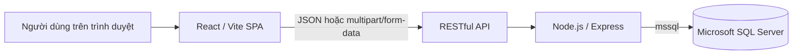
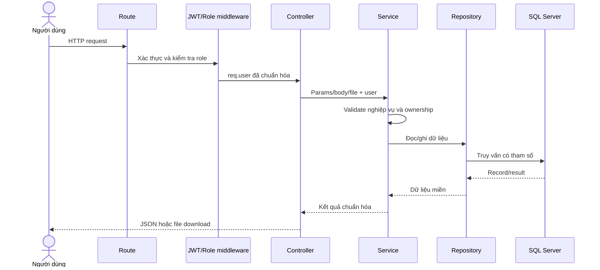
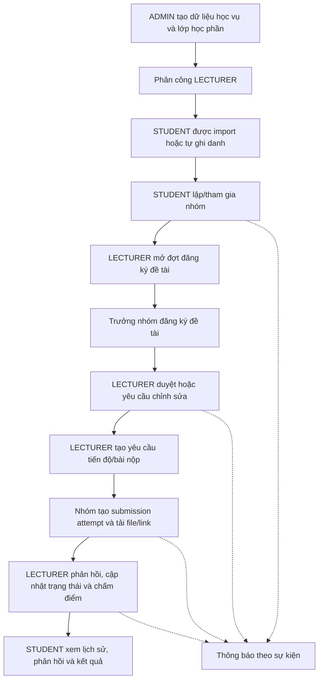
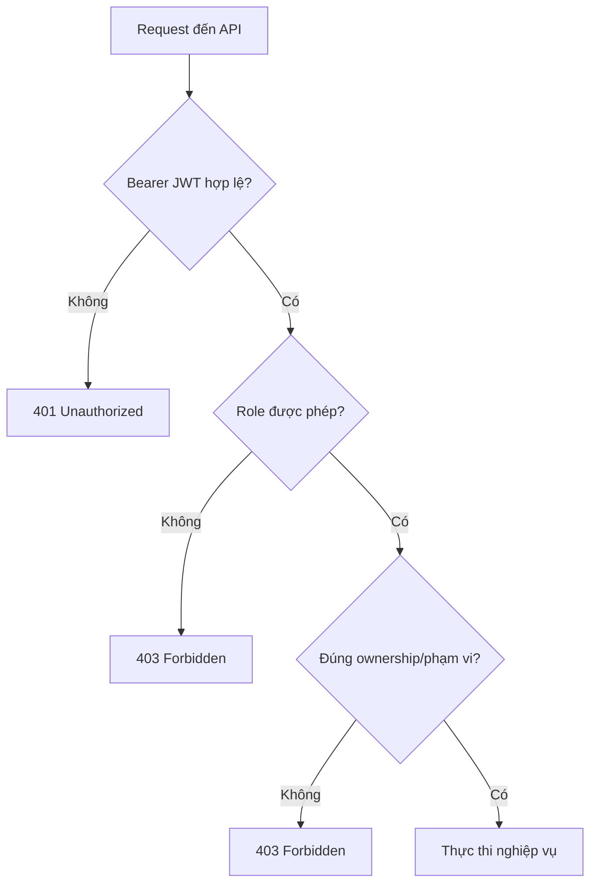

# Kiến trúc TVU Student Project Portal

## 1. Tổng quan

TVU Student Project Portal là ứng dụng web quản lý lớp học phần và vòng đời đồ
án. Hệ thống hiện được triển khai theo mô hình frontend tách biệt với một
RESTful API dạng modular monolith:



Ba vai trò nghiệp vụ:

- **ADMIN** quản trị người dùng và dữ liệu học vụ, lớp học phần, danh sách giảng
  viên/sinh viên, ghi danh và chuyển lớp.
- **LECTURER** thao tác trên lớp mình phụ trách: nhóm, đợt/đề tài, yêu cầu tiến
  độ hoặc bài nộp, attempt, phản hồi, tiêu chí và điểm.
- **STUDENT** thao tác trong phạm vi lớp đã ghi danh và nhóm của mình: lập/tham
  gia nhóm, đăng ký đề tài, nộp tiến độ/bài, theo dõi attempt, phản hồi và điểm.

## 2. Các khối hệ thống

### Frontend

`frontend` là SPA React được build và phục vụ bởi Vite trong môi trường phát
triển. React Router định tuyến trang công khai, trang yêu cầu đăng nhập và trang
theo role. Lớp `frontend/src/api` gom lời gọi HTTP, gắn JWT lấy từ local storage
vào Bearer header và xử lý lỗi API dùng chung.

Các nhóm màn hình phản ánh những miền chính: học vụ/lớp học phần, import và ghi
danh, nhóm, đợt đăng ký/đề tài, yêu cầu nộp, tiến độ tuần, lịch sử attempt, chấm
điểm, dashboard và thông báo.

### RESTful API và backend

`backend/src/app.js` cấu hình CORS, JSON/form parsing, Swagger, route `/api` và
error handling. `backend/src/routes/index.js` lắp các router của từng module.
`backend/src/server.js` đợi kết nối SQL Server thành công trước khi mở cổng HTTP.

Backend được chia theo module nghiệp vụ:

- `academics`: năm học, học kỳ, môn học, lớp học phần;
- `courseEnrollments`, `students`, `lecturers`: ghi danh, chuyển lớp và import;
- `groups`, `topicRounds`: nhóm, đợt đăng ký và đề tài;
- `submissions`, `grading`: yêu cầu nộp, tiến độ, submission attempt, file,
  phản hồi, tiêu chí và điểm;
- `notifications`, `dashboard`: thông báo và số liệu tổng hợp;
- `auth`, `users`: đăng nhập, hồ sơ và quản trị tài khoản.

### SQL Server và file

Repository dùng thư viện `mssql` để truy vấn SQL Server. Các thay đổi schema theo
thời gian nằm trong `database/migrations`.

Metadata file được lưu trong database; nội dung file upload hiện được lưu cục bộ
dưới `backend/uploads` thông qua service lưu trữ. Việc tải xuống đi qua API và
kiểm tra quyền, không được coi đường dẫn lưu file là URL công khai.

## 3. Luồng xử lý backend

Luồng chuẩn của một request:



Trách nhiệm từng lớp:

1. **Route** khai báo URL, HTTP method, upload middleware, xác thực và role.
2. **Controller** chuyển dữ liệu HTTP sang lời gọi service và tạo response.
3. **Service** chứa validation, quy tắc trạng thái, ownership và orchestration
   (ví dụ tạo notification hoặc dọn file khi nộp lỗi).
4. **Repository** truy cập SQL Server, ánh xạ record và thực hiện transaction
   khi nghiệp vụ cần tính nguyên tử.

Một số module có thêm middleware, validation hoặc service dùng chung, nhưng
không làm thay đổi luồng `Route → Controller → Service → Repository`.

## 4. Luồng nghiệp vụ chính



### Lớp học phần và ghi danh

ADMIN quản lý cấu trúc năm học–học kỳ–môn học–lớp và phân công một giảng viên
cho lớp. Sinh viên có thể được thêm/import, tự ghi danh vào lớp phù hợp, rút ghi
danh hoặc được ADMIN chuyển lớp. Các ràng buộc sức chứa, trùng ghi danh và dữ
liệu workflow liên quan được kiểm tra ở backend.

### Nhóm và đề tài

STUDENT đã ghi danh có thể tạo nhóm. Các thao tác thành viên và chuyển trưởng
nhóm phụ thuộc membership/leadership. LECTURER chỉ quản lý đợt đăng ký và duyệt
đề tài thuộc lớp mình phụ trách. File đính kèm của đợt đăng ký được kiểm soát
quyền khi tải lên, xem hoặc xóa.

### Tiến độ, submission attempt và file

LECTURER cấu hình yêu cầu nộp bài hoặc tiến độ tuần, thời gian mở/đóng, nộp trễ,
nộp lại, số attempt tối đa và các mục nội dung/file/link. Mỗi lần nhóm nộp tạo
một attempt để giữ lịch sử. Với tiến độ tuần, source giới hạn thao tác nộp cho
trưởng nhóm. File được kiểm tra loại, kích thước và ownership trước khi lưu hoặc
tải xuống.

### Chấm điểm và thông báo

LECTURER phụ trách lớp có thể xem bài nộp, thay đổi trạng thái, phản hồi, quản lý
tiêu chí và ghi điểm. STUDENT chỉ xem kết quả/lịch sử thuộc nhóm của mình.
Notification được tạo theo sự kiện nghiệp vụ và chỉ người nhận mới được đọc hoặc
đánh dấu trạng thái.

## 5. Xác thực và phân quyền



- Login trả access token JWT; request được bảo vệ gửi token bằng
  `Authorization: Bearer <token>`.
- Auth middleware xác minh chữ ký, lấy định danh và chuẩn hóa role về `ADMIN`,
  `LECTURER` hoặc `STUDENT`.
- Role middleware giới hạn nhóm endpoint.
- Service/repository kiểm tra ownership theo ngữ cảnh: giảng viên được phân công
  cho lớp, sinh viên đang ghi danh, thành viên/trưởng nhóm, bài nộp và người nhận
  notification.
- Frontend `ProtectedRoute`/`RoleRoute` giúp ẩn và điều hướng màn hình, nhưng
  backend vẫn là ranh giới bảo mật có thẩm quyền.

Secret ký JWT, mật khẩu database và mật khẩu tài khoản chỉ đặt trong `.env` cục
bộ hoặc secret store của môi trường triển khai; không đưa vào repo hay log.

## 6. Cấu hình, chạy và kiểm thử

### Cài dependency

```bash
cd backend
npm install

cd ../frontend
npm install
```

### Cấu hình

Sao chép `backend/.env.example` thành `backend/.env` và cấu hình cổng, kết nối
SQL Server, JWT, bcrypt và CORS. Sao chép `frontend/.env.example` thành
`frontend/.env` rồi cấu hình `VITE_API_BASE_URL`.

Không commit hai file `.env`. Database phải có schema nền tương thích; áp dụng
các file trong `database/migrations` theo thứ tự tên file sau khi đã backup và
review. Repo hiện không có script package để tự động chạy migration hoặc tạo
toàn bộ database từ đầu.

### Chạy

```bash
# terminal backend
cd backend
npm run dev

# terminal frontend
cd frontend
npm run dev
```

Mặc định theo file mẫu/source:

- Frontend: `http://localhost:5173`
- REST API: `http://localhost:5000/api`
- Health check: `http://localhost:5000/api/health`
- Swagger UI: `http://localhost:5000/api-docs`
- OpenAPI JSON: `http://localhost:5000/api-docs.json`

### Kiểm thử

```bash
cd backend
npm test
npm run test:regression

cd ../frontend
npm run lint
npm run build
```

`npm test` chạy unit/contract test bằng Node test runner. Regression suite chạy
tuần tự và cần database test được cấu hình; không nên trỏ nó vào dữ liệu thật.
Frontend hiện có lint/build nhưng chưa khai báo test runner trong package.

## 7. Định hướng tiếp theo

Các hạng mục dưới đây là hướng phát triển, không phải thành phần hiện có:

- Docker hóa frontend, backend và cấu hình môi trường.
- GitHub Actions cho lint, test, build, security checks và deployment.
- Triển khai VPS qua reverse proxy, HTTPS và quy trình rollback.
- RabbitMQ cho notification hoặc job nền cần xử lý bất đồng bộ.
- Chỉ tách microservice khi có nhu cầu scale/ownership độc lập và ranh giới dữ
  liệu rõ ràng.
- Monitoring gồm structured logging, metrics, tracing, dashboard và alert.
- Backup định kỳ cho SQL Server và file upload, mã hóa bản sao, retention và
  kiểm thử restore.
