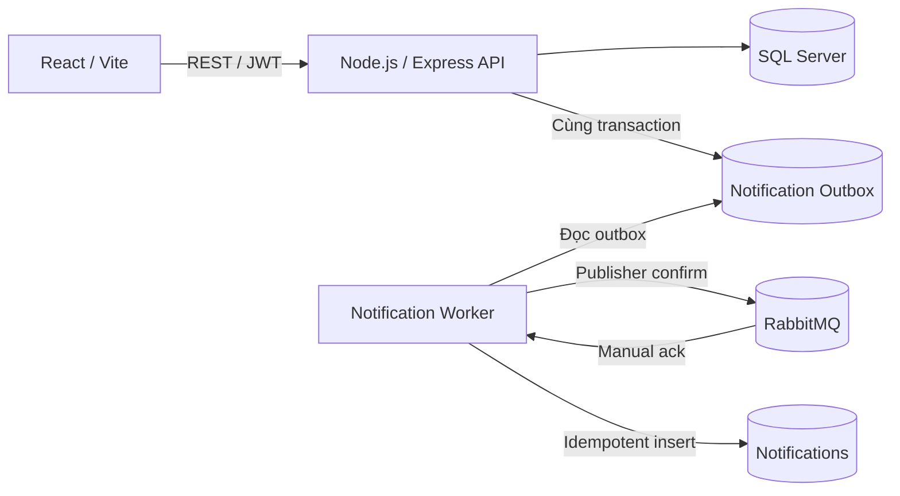

# Kiến trúc TVU Student Project Portal

> Vận hành production dùng structured JSON logging, request/correlation ID và Prometheus metrics cho API, SQL Server, RabbitMQ, outbox và worker. Xem [monitoring.md](monitoring.md) và [backup-restore.md](backup-restore.md).

## Tổng quan

Backend giữ cấu trúc Route → Controller → Model/Repository. Controller không
gọi RabbitMQ. Các model thực hiện thay đổi nghiệp vụ và ghi event vào
`NotificationOutbox` trong cùng SQL transaction. Worker độc lập publish và
consume event; API vẫn hoạt động khi RabbitMQ tạm thời không sẵn sàng.

API notification hiện hữu chỉ đọc và cập nhật trạng thái đã đọc. Các service
nghiệp vụ mới ghi outbox thay vì insert trực tiếp vào `Notifications`; handler
consumer là nơi duy nhất materialize notification cho các event bất đồng bộ.

JWT xác thực người dùng; middleware role phân quyền `ADMIN`, `LECTURER`,
`STUDENT`. Các controller tiếp tục kiểm tra ownership của lớp, đề tài, báo cáo
và bài nộp trước khi gọi model.

## Notification

Event contract gồm `eventId`, `eventType`, `occurredAt`, `recipientIds`,
`actor`, `entityType`, `entityId`, `payload` và `correlationId`. Payload chỉ
chứa nội dung cần tạo notification, không chứa token, password hoặc file.

RabbitMQ dùng durable direct exchange/queue, persistent message, publisher
confirm, manual ack, bounded retry và dead-letter queue. `(UserId, EventKey)`
trên bảng `Notifications` giữ tương thích dữ liệu cũ và chống tạo trùng theo
`eventId`.

Chi tiết xem [rabbitmq-notifications.md](rabbitmq-notifications.md).
